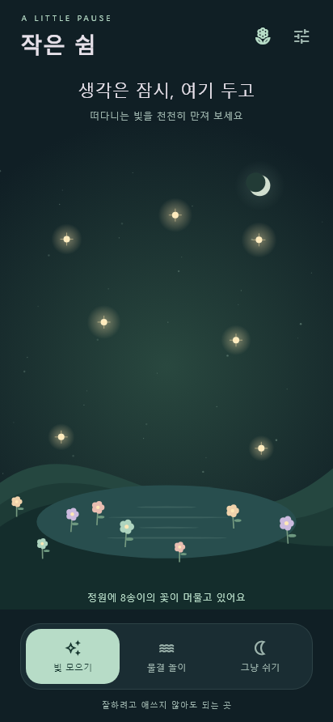

# 작은 쉼 · A Little Pause

생각이 많을 때, 손끝으로 잠깐 쉬어 가는 오프라인 Flutter 게임입니다.

- **빛 모으기**: 떠다니는 빛을 터치하세요. 다섯 조각마다 꽃 한 송이가 피어납니다.
- **물결 놀이**: 화면을 톡 건드리면 물결이 번지고 천천히 사라집니다.
- **그냥 쉬기**: 달빛과 느리게 움직이는 원을 바라보며 자유롭게 머무릅니다. 호흡 속도를 맞출 필요는 없습니다.
- **나의 정원**: 꽃은 시들지 않습니다. 누적 꽃 수를 저장하며 화면에는 최대 24송이를 그립니다.
- 진동 켜기/끄기, 움직임 줄이기, 시스템 애니메이션 감소 설정을 지원합니다.
- 로그인, 광고, 결제, 알림, 출석, 실패, 시간 제한이 없습니다. 소리 없는 게임입니다.

## 갤럭시에 설치

1. 이 저장소의 [v1.0.0 릴리스](https://github.com/Jenous0134/H_app_Y/releases/tag/v1.0.0)에서 `little-pause-1.0.0.apk`를 휴대폰으로 다운로드합니다.
2. **내 파일 → 다운로드**에서 APK를 엽니다.
3. 설치 허용 안내가 나오면 해당 앱의 **출처를 알 수 없는 앱 설치**를 이번 설치에 허용합니다. One UI 버전에 따라 메뉴 이름이 다를 수 있습니다.
4. 설치 후 앱 목록에서 **작은 쉼**을 실행합니다. 설치 허용은 이후 다시 끌 수 있습니다.

USB 디버깅을 사용하는 개발 환경에서는 `adb install -r little-pause-1.0.0.apk`로 설치할 수도 있습니다.

Android 최소 버전과 APK 무결성 정보는 릴리스 설명을 확인하세요. APK는 ARM 32비트, ARM64, x86_64를 포함합니다.

## 데이터와 서명

정원과 설정만 SharedPreferences로 기기에 저장합니다. 서버 전송, 계정, 인터넷 권한이 없으며 Android 백업도 비활성화했습니다. 앱 삭제 또는 앱 데이터 삭제 시 기록이 사라집니다.

개인 설치용 **release 모드 / 로컬 debug 키 서명** 빌드입니다. Play Store 배포용 서명 설정은 아닙니다. 같은 기기에 업데이트할 때는 같은 서명 키가 필요합니다. 키 파일은 저장소에 올리지 않습니다.

마음을 잠깐 환기하는 놀이이며 진단·치료를 제공하지 않습니다.

## 개발

검증 환경: Flutter 3.44.2 / Dart 3.12.2 / JDK 17 / Android SDK 36.

```sh
flutter pub get
flutter analyze
flutter test
flutter build apk --release
```

산출물: `build/app/outputs/flutter-apk/app-release.apk`

화면은 Flutter CustomPainter로 직접 그립니다. 이미지 다운로드나 외부 에셋이 필요하지 않습니다. 저장에는 Flutter 팀의 [shared_preferences](https://pub.dev/packages/shared_preferences)를 사용합니다.

테스트는 빛 수집과 꽃 성장, 저장·복원, 모드 전환, 설정, 360×640 화면과 1.6배 글자 크기를 검증합니다. 실제 갤럭시는 연결되어 있지 않아 실기기 실행은 확인하지 못했습니다.

`docs/preview.png`는 테스트 렌더러로 생성한 미리보기이며 실기기 스크린샷이 아닙니다. 미리보기 테스트는 Windows의 맑은 고딕이 있을 때만 실행하며 폰트 파일은 배포하지 않습니다.


